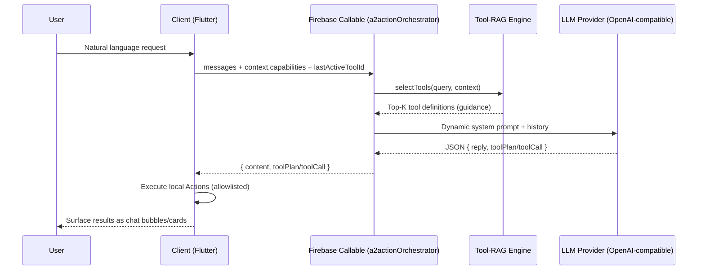

# A2Action (RAG 2.0) — Client ↔ Server Tool‑Routing Framework

**A2Action = Agent to Action.** The core idea is to transform user natural language (text / speech‑to‑text) into **executable client‑side Actions** or an **Action chain (toolPlan)**, so AI products move from “chatting” to “doing and orchestrating” on-device capabilities. We believe this will be a major trend and the default shape of future AI products.

This repository is a minimal, open‑source‑friendly demo extracted from EchoVita, focusing on the **RAG 2.0 (Tool‑RAG) architecture** and the **client ↔ server interaction protocol**.

Think of it as an end‑to‑end skeleton for:
“**User intent → backend plans toolCall/toolPlan → client executes local capabilities → chat surfaces results as cards**”.

Note: This repo intentionally contains **framework + protocol only** and excludes EchoVita’s production features and implementation details.

中文版本：[README.md](README.md)

## Layout

- [server/firebase/functions/](server/firebase/functions/): Firebase Functions (Node.js 20 + TypeScript) callable `a2actionOrchestrator` (Tool‑RAG selection + dynamic prompt injection + LLM call)
- [client/flutter/](client/flutter/): Flutter client SDK (capability catalog export → callable invocation → toolPlan/toolCall execution loop)
- [docs/](docs/): architecture and protocol docs

## What “RAG 2.0” means here

Classic RAG usually means “retrieve documents → inject context → answer”.

**A2Action’s RAG 2.0 is Tool‑RAG**: you retrieve **executable capabilities (Actions/Tools)**, not documents.

Key shifts:

- **From “inject all tools” → “inject only Top‑K tools”**: avoids context overflow, reduces token cost and latency
- **From “regex/keywords routing” → “semantic routing + hybrid scoring”**: more robust across languages and phrasing
- **From “LLM answers” → “LLM plans, client executes”**: execution becomes verifiable, observable, and replayable

## Why this matters (and why it will become mainstream)

- Tool catalogs grow faster than prompt windows; **dynamic Top‑K injection** becomes the default
- Multilingual intent is hard to cover with rules; **embeddings generalize better**
- Safety is stronger when **the model only plans** and the **client executes a whitelist**
- Iteration is cheaper: tune `registry.json` + vectors and redeploy Functions, without shipping client secrets
- `toolPlan` enables **multi‑step automation** (“scan → clean → recap”) naturally

## End‑to‑end flow (diagram)



## Quick start

Detailed instructions: [docs/DEPLOYMENT.en.md](docs/DEPLOYMENT.en.md) (English) / [docs/DEPLOYMENT.zh-CN.md](docs/DEPLOYMENT.zh-CN.md) (中文).

> **Note**: This demo uses **Firebase Functions** for the backend to provide an out-of-the-box experience. However, this is **not a strict requirement**. The core logic can be ported to **any backend architecture (Python/FastAPI, Go/Gin, Java/Spring, etc.)**.
> You simply need to implement two things on your server:
> 1. **Vector Search API**: Retrieve Top-K tool definitions based on the user's query.
> 2. **LLM Interaction API**: Inject the retrieved tools into the prompt and return the LLM's toolPlan/toolCall response.

### 1) Server (Firebase Functions)

```bash
cd server/firebase
npm --prefix functions install
npm --prefix functions run build:tool-vectors
npm --prefix functions run build

cp .firebaserc.example .firebaserc
firebase functions:secrets:set A2ACTION_API_KEY
firebase deploy --only functions
```

Optional: build stronger vectors using a remote embeddings endpoint (you provide the endpoint and key)

```bash
export A2ACTION_EMBEDDINGS_PROVIDER=dashscope
export A2ACTION_API_KEY="your_key"
export A2ACTION_EMBEDDINGS_URL="<YOUR_EMBEDDINGS_ENDPOINT>"
npm --prefix server/firebase/functions run build:tool-vectors
```

### 2) Client (Flutter)

This repo’s `client/flutter` is a **Flutter package** (Dart‑only). It intentionally does **not** ship platform project files.

Recommended way: create a new Flutter app and add this package via `path` dependency:

```bash
flutter create a2action_demo_app
cd a2action_demo_app

# in pubspec.yaml:
# a2action_client_demo:
#   path: <PATH_TO>/A2Action/client/flutter

flutter run
```

Try:

- “scan storage”
- “open <URL>”
- “play <M3U_URL>”

## Built‑in demo actions

- `demo.echo.v1`
- `demo.storage.scan.v1`
- `demo.url.open.v1`
- `demo.ocr.image.v1`
- `demo.playlist.open.v1`

## Add a real action (recommended flow)

1) Client: implement an `A2Action` and register it in the registry
2) Server: add the same `actionId` to [server/firebase/functions/src/tools/registry.json](server/firebase/functions/src/tools/registry.json)
3) Rebuild vectors: `npm --prefix server/firebase/functions run build:tool-vectors`
4) Deploy Functions: `cd server/firebase && npm --prefix functions run build && firebase deploy --only functions`

Docs:
- [docs/ARCHITECTURE.en.md](docs/ARCHITECTURE.en.md) / [docs/ARCHITECTURE.zh-CN.md](docs/ARCHITECTURE.zh-CN.md)
- [docs/PROTOCOL.en.md](docs/PROTOCOL.en.md) / [docs/PROTOCOL.zh-CN.md](docs/PROTOCOL.zh-CN.md)
- [docs/DEPLOYMENT.en.md](docs/DEPLOYMENT.en.md) / [docs/DEPLOYMENT.zh-CN.md](docs/DEPLOYMENT.zh-CN.md)

## EchoVita (recommended)

This framework is proven in **EchoVita** (a conversational device wellness assistant).

- iOS: [https://apps.apple.com/us/app/echovita/id6755916301](https://apps.apple.com/us/app/echovita/id6755916301)
- Android: [https://play.google.com/store/apps/details?id=com.assistant.echovita.localmcp.ai](https://play.google.com/store/apps/details?id=com.assistant.echovita.localmcp.ai)
- Product Hunt: [https://www.producthunt.com/products/echovita?launch=echovita&utm_source=github.com](https://www.producthunt.com/products/echovita?launch=echovita&utm_source=github.com)

## License

MIT. See `LICENSE`.
