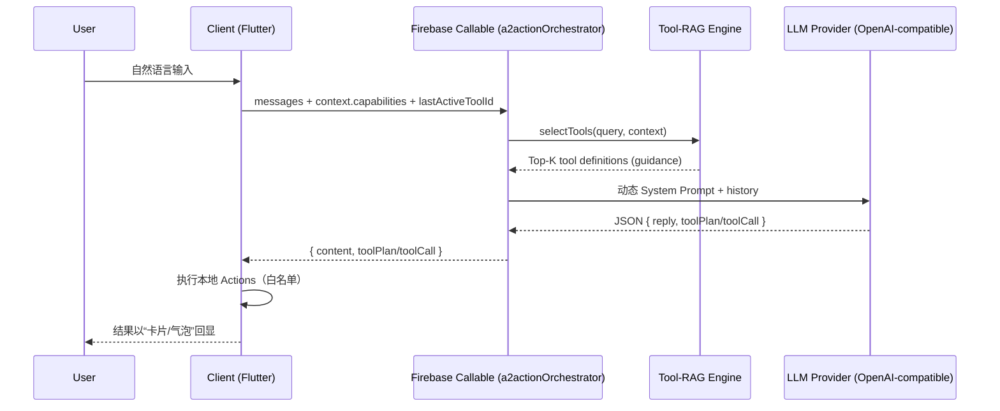

# A2Action (RAG 2.0) — Client ↔ Server Tool‑Routing Framework (Demo)

**A2Action = Agent to Action**。核心是把用户的自然语言（文本/语音转写）转化为能在客户端执行的 **Action** 或 **Action chain（toolPlan）**，让 AI 从“会聊天”升级为“能真正触发与编排设备能力”的 Agent。我们相信这会成为未来 AI 产品的重要趋势与默认形态。

这是一个从 EchoVita 项目中抽象出来的 **RAG 2.0（Tool‑RAG）架构 + 客户端交互协议** 的最小可运行 Demo：  
你可以把它当作 “**自然语言 → 后端规划 toolCall/toolPlan → 客户端执行本地 Actions → 对话内回显结果卡片**” 的一整套工程骨架。

> 说明：此仓库只保留框架与协议示例，不包含 EchoVita 的真实业务功能/实现细节。

English: `README.en.md`

## 目录结构

- `server/firebase/functions/`：Firebase Functions (Node.js 20 + TS) 的 `a2actionOrchestrator`（RAG 2.0 工具选择 + 动态 Prompt 注入 + LLM 调用）
- `client/flutter/`：Flutter 客户端 SDK（ActionRegistry 导出能力列表 → 调用 callable → 执行 toolPlan/toolCall）
- `docs/`：架构与协议说明

## “RAG 2.0” 在这里指什么？

传统 RAG 往往是 “检索文档 → 拼接上下文 → 让模型回答”。  
**A2Action 的 RAG 2.0 是 Tool‑RAG：检索的不是文档，而是 *可执行能力（Actions/Tools）*。**

关键变化：

- **从“全量注入工具说明” → “按需注入 Top‑K 工具说明”**：避免 Context 溢出，并降低 token 成本与延迟
- **从“关键词/正则路由” → “向量语义路由 + 混合加权”**：跨语言更稳、更能覆盖表达变体
- **从“模型回答为主” → “模型规划 + 客户端执行为主”**：执行结果可验证、可观测、可回放

## 核心优势（为什么它在 AI 时代会越来越流行）

- **能力爆炸必然导致 Prompt 爆炸**：App 能力越多，传统“把所有工具都塞进系统提示词”的方式越不可持续；Top‑K 动态注入会成为默认解法
- **多语言/多表达天然难覆盖**：Embedding 让同一能力可被不同语言/表达方式稳定命中
- **更安全、更可控**：模型只做规划（toolCall/toolPlan），真实执行在客户端白名单动作里完成；服务端再做一次 allowlist 过滤，降低“幻觉执行”
- **迭代成本更低**：工具语义/指令在 `registry.json` 里可快速调优；无需频繁发版即可改进路由效果（只需更新 Functions + vectors）
- **可链式编排**：`toolPlan` 天然支持多步自动化，适合“先扫描 → 再清理 → 再复盘”的工作流

## 架构一图流（端到端）



## 快速开始（Demo）

更详细的部署、Emulator、本地开发与排障说明见：`docs/DEPLOYMENT.zh-CN.md`（中文）与 `docs/DEPLOYMENT.en.md`（English）。

### 1) 部署服务端（Firebase Functions）

```bash
# 进入 Firebase 工程目录（包含 firebase.json / .firebaserc）
cd server/firebase

# 安装与构建 Functions（推荐用 --prefix，避免 cd 来回切换）
npm --prefix functions install

# 默认使用 toy embedding 生成向量（无需外部 Key）
npm --prefix functions run build:tool-vectors
npm --prefix functions run build

# 配置 Firebase 项目（示例文件）
cp .firebaserc.example .firebaserc

# 设置 LLM Key（Firebase Secret）
firebase functions:secrets:set A2ACTION_API_KEY

# 部署
firebase deploy --only functions
```

可选：使用远程 embedding 生成更强的 tool vectors（需要你自己提供 endpoint 与 key）

```bash
export A2ACTION_EMBEDDINGS_PROVIDER=dashscope
export A2ACTION_API_KEY="your_key"
export A2ACTION_EMBEDDINGS_URL="<YOUR_EMBEDDINGS_ENDPOINT>"
npm --prefix server/firebase/functions run build:tool-vectors
```

### 2) 使用客户端（Flutter）

```bash
# 本仓库的 client 目录是 Flutter package（只包含 Dart 代码，不包含平台工程文件）。
# 推荐做法：新建一个 Flutter App，然后以 path dependency 的方式接入该 package。

flutter create a2action_demo_app
cd a2action_demo_app

# 在新 App 的 pubspec.yaml 里添加：
# a2action_client_demo:
#   path: <PATH_TO>/A2Action/client/flutter

flutter run
```

启动后可直接尝试：

- “scan storage”
- “open <URL>”
- “play <M3U_URL>”

## Demo 里内置的 Actions（可按需删改）

- `demo.echo.v1`
- `demo.storage.scan.v1`
- `demo.url.open.v1`
- `demo.ocr.image.v1`
- `demo.playlist.open.v1`

## 如何新增一个真实 Action（推荐流程）

1. 客户端：实现一个 `A2Action`，并在 `A2ActionRegistry` 注册（`client/flutter/lib/actions/*`）
2. 服务端：在 `server/firebase/functions/src/tools/registry.json` 增加同名 `actionId` 的语义与 guidance
3. 生成向量：`npm --prefix server/firebase/functions run build:tool-vectors`
4. 部署 Functions：`cd server/firebase && npm --prefix functions run build && firebase deploy --only functions`

更多细节见：
- `docs/ARCHITECTURE.zh-CN.md` / `docs/ARCHITECTURE.en.md`
- `docs/PROTOCOL.zh-CN.md` / `docs/PROTOCOL.en.md`
- `docs/DEPLOYMENT.zh-CN.md` / `docs/DEPLOYMENT.en.md`

## EchoVita（推荐）

这个 Demo 的原始落地应用是 **EchoVita**（对话式设备健康助手）。如果你对 “AI 驱动本地能力编排 + 结果卡片回显” 这种交互感兴趣，可以直接体验：

- iOS：https://apps.apple.com/us/app/echovita/id6755916301
- Android：https://play.google.com/store/apps/details?id=com.assistant.echovita.localmcp.ai
- Product Hunt：https://www.producthunt.com/products/echovita?launch=echovita&utm_source=github.com

## License

默认附带 `LICENSE`（MIT）。如需更换协议可自行调整。
